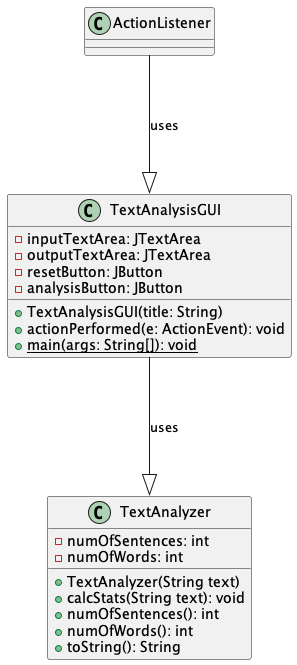
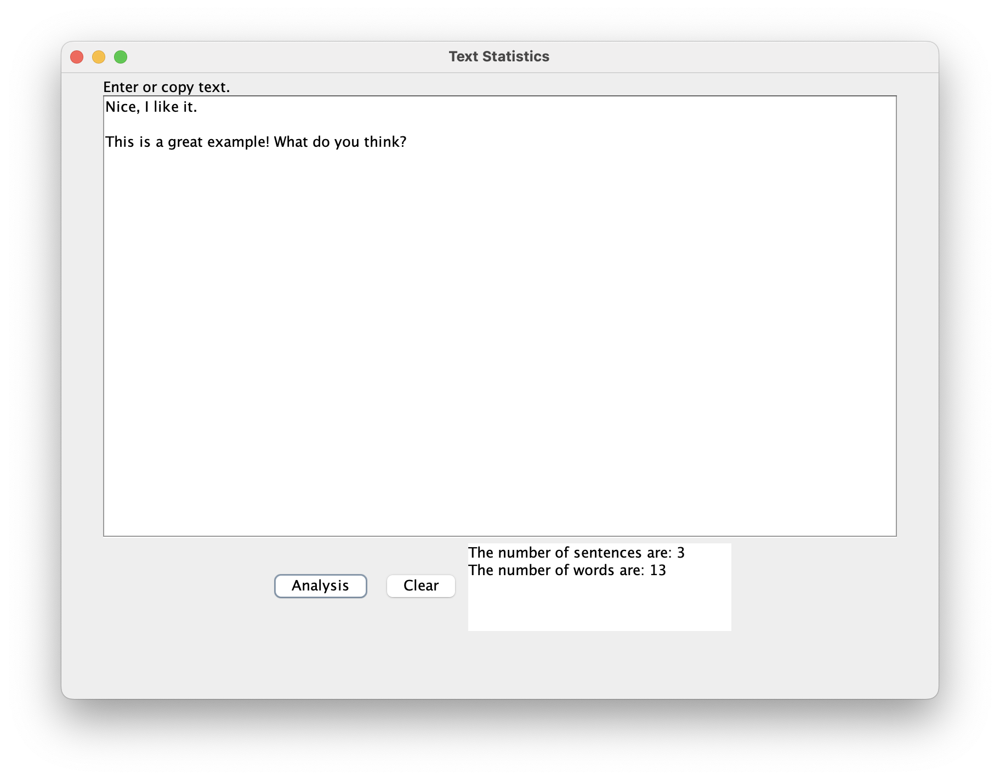
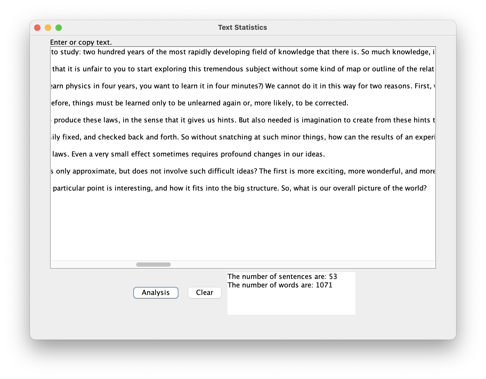

# Text Analysis report
Author: Yajur Vashisht

## UML class diagram

@startuml

	class TextAnalyzer {
	-numOfSentences: int
	-numOfWords: int
	+TextAnalyzer(String text)
	+calcStats(String text): void
	+numOfSentences(): int
	+numOfWords(): int
	+toString(): String
	}
	
	class TextAnalysisGUI {
	-inputTextArea: JTextArea 
	-outputTextArea: JTextArea 
	-resetButton: JButton 
	-analysisButton: JButton 
	+TextAnalysisGUI(title: String)
	+actionPerformed(e: ActionEvent): void
	+{static} main(args: String[]): void
	}
	
	ActionListener ---|> TextAnalysisGUI: uses
	TextAnalysisGUI ---|> TextAnalyzer: uses

@enduml

## Execution and Testing

