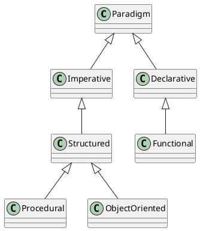
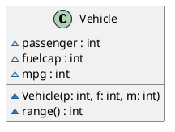
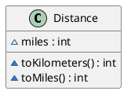

# Lecture l03

## Goal: Introduce Classes and Objects

- Object oriented programming uses classes and objects to combine data and actions, i.e. data comes with actions.
- A class defines what data and actions objects can contain/perform.
- Unified Modeling Language (UML) is used to create visual representations of classes. A class is represented as a box with three sections: class name, instance variables, methods.
- To create an object, the constructor is called preceded by `new`.
- Inside the class, `this` can be used to refer to the current object.
 

## Reading
Chapter 4, all and skip:
- Try This 4-1

## Warm-up
In your `my-work` Eclipse workspace create a java project and a program that displays all upper case characters from `'A'` to `'Z'` by using a `char` variable and the fact that `char` can be treated as a number.

## Introduce functions aka static methods
We are doing imperative, structured programming. By creating functions to combine sequence of code statements that can be re-used we cover all aspects of procedural programming.

In `l02/LogicalOpTable.java` re-factor code with function(s). In Java traditional functions would be written as static methods.

## Activity: Programming languages and paradigms
People say: Python is a multi-paradigm programming language. What do they mean by that? Is Java a multi-paradigm language? Why or why/not?

1. Do your individual research to answer this question (5min)
2. Summarize your findings and share it with your neighbor (2x2min)
3. Share highlights with the class (10min)

Programming paradigms
1. Imperative programming, define sequence of statements, manage state
    - Structured programming: variables, if-else and loops, subroutines
        - Procedural programming: create functions that can be re-used
        - Object oriented programming: Objects combine data and actions
2. Declarative programming: code is a specification of the desired end result
    - Functional programming: apply and compose functions
    

## Introduction to classes and objects including their UML representation
Another form of imperative, structured programming is object oriented programming, the focus of this course.

### UML
The `Vehicle` class from the textbook can be represented in UML using [plantuml](https://plantuml.com/class-diagram) in the following way:

The UML diagram has three parts:
1. class name
2. instance variables (data)
3. methods (actions)

### Vehicle class
1. Implement the `Vehicle` class as described in the UML above in a file `VehicleDemo.java`.
2. Write a main that creates two vehicle objects:
    - minivan: 7 passengers, 16 gallons, 21 mpg
    - sportscar: 2 passengers, 14 gallons, 12 mpg
3. Add print statements to main that report the range of the the two objects with descriptive text. 

### Distance class to convert miles to kilometers

The class `Distance` has one instance variable `miles` of type `int` and two methods `toKilometers()` and `toMiles()` that return the distance in kilometers and miles respectively as `int`.

1. Draw the UML diagram of the `Distance` class
2. Implement the `Distance` class 
3. add JavaDoc, and verify class, variable and method names adhere to convention.
4. add a `Distance` object to the `VehicleDemo` main to output the range in kilometers.

## Chapter Questions
- Chapter 4 Self-Test 1. What is the difference between a class and an object?
- Chapter 4 Self-Test 4. Create an object `counter` of class `MyCounter` in two statements. 
- Chapter 4 Self-Test 5. Method declaration with parameters and return value.
- Chapter 4 Self-Test 10. What is `this`?
- Chapter 4 Self-Test 12. Return type of a methods when nothing is returned.

## Programming Exercises
- Add a method `toString()` to the `Vehicle` class that returns a string describing the object, e.g. `"5 passengers, 12 gallons, 10 mpg"`.
- Add an instance variable `type` to the `Vehicle` class that can hold a string describing the vehicle, e.g. `"minivan"`. Adapt `toString()` to include the type instance variable.
- Add a method `toString()` to the `Distance` class that returns a string representation of the object, e.g. `"10 miles"`.
- How could we make the `Distance` class more unit friendly, meaning that we could set the units and obtain value and string representation with selected units? See `DistanceEnhanced.java` for one possibility.
